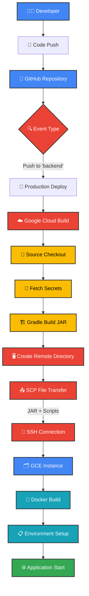

# 👟 걷는 (Go For A Walk) - Backend Server

> **하루에 한 번, 나의 운동 기록을 남기는 습관**  
> 간편하게 걷기 인증을 남기고, 나의 걸음을 일기로 남겨보세요.

[](https://kotlinlang.org/)
[](https://spring.io/projects/spring-boot)
[](https://cloud.google.com/)

## 📱 관련 프로젝트

[](https://github.com/devclub-official/goforawalk_Android)

[](https://github.com/devclub-official/goforawalk_iOS)


---

## 📖 프로젝트 소개

"걷는"은 사용자가 매일 걷기 습관을 기록하고 관리할 수 있는 모바일 애플리케이션의 백엔드 서버입니다.

### 🎯 주요 기능

- **🔐 소셜 로그인**: 카카오톡 OAuth2 인증
- **📸 발자취 인증**: 사진과 함께 하루 1회 운동 기록
- **📱 피드 조회**: 시간순으로 정렬된 인증 기록 조회
- **👤 프로필 관리**: 연속 인증 일수, 총 인증 수 확인
- **⚙️ 계정 관리**: 회원탈퇴 등 사용자 데이터 관리

### 🏃‍♂️ 사용자 시나리오

1. **카카오톡으로 간편 로그인**
2. **오늘의 걷기 후 사진 촬영**
3. **간단한 한 줄 일기와 함께 인증 등록**
4. **홈 피드에서 나의 걷기 기록 확인**
5. **프로필에서 연속 인증 현황 체크**

### 📜 API 문서

> https://api.goforawalk.site/docs/index.html

---

## 🛠️ 기술 스택

### **Backend Framework**
- **Kotlin** 1.9.25 - 메인 개발 언어
- **Spring Boot** 3.4.4 - 애플리케이션 프레임워크
- **Spring Security** 6.4.4 - 인증/인가 처리
- **Spring Data JPA** 3.4.4 - 데이터 액세스 레이어

### **Database & Storage**
- **MySQL(Google Cloud SQL)** - 프로덕션 데이터베이스
- **H2** - 테스트/개발 환경
- **Google Cloud Storage** - 이미지 파일 저장
- **Caffeine** - 애플리케이션 레벨 캐싱

### **Authentication & Security**
- **OAuth2 Client** - 소셜 로그인
- **JWT (JJWT)** 0.12.6 - 토큰 기반 인증
- **Spring Security OAuth2** - OAuth2 통합

### **Cloud & DevOps**
- **Google Cloud Platform** - 클라우드 인프라
- **Google Cloud Build** - CD 파이프라인

### **Development & Testing**
- **Gradle (Kotlin DSL)** - 빌드 도구
- **Spring REST Docs** - API 문서 자동 생성
- **WireMock** - 외부 API 모킹
- **REST Assured** - API 테스트
- **JUnit 5** - 단위/통합 테스트

---

## 🏗️ 프로젝트 구조

```
📁 src/main/kotlin/side/flab/goforawalk/
├── 🚀 app                           # Application Layer
│   ├── 🌐 api                       # REST API Controllers
│   │   ├── user                     # 사용자 관련 API
│   │   ├── footstep                 # 발자취 관련 API
│   │   └── profile                  # 프로필 관련 API
│   │
│   ├── 🔐 auth                      # 인증/보안 설정
│   │   ├── filter                   # JWT 인증 필터
│   │
│   ├── 📄 docs                      # API 문서 컨트롤러
│   │
│   ├── 🎯 domain                    # Domain Layer
│   │   ├── 👤 user                  # 사용자 도메인
│   │   │   ├── domain              # 도메인 모델
│   │   │   └── application          # 애플리케이션 서비스
│   │   │
│   │   ├── 🚶 footstep              # 발자취 도메인
│   │   │   ├── domain               # 도메인 모델
│   │   │   └── application          # 애플리케이션 서비스
│   │   │
│   │   └── 👨‍💼 profile               # 프로필 도메인
│   │       └── application          # 애플리케이션 서비스
│   │
│   └── 🛠️ support/                   # 공통 유틸리티
│       ├── base/                     # 기본 엔티티/컨트롤러
│       ├── error/                    # 에러 처리
│       ├── web/                      # Web MVC 설정
│       ├── jpa/                      # JPA 설정
│       ├── gcp/                      # Google Cloud 설정
│       └── image/                    # 이미지 업로드 처리
│
└── 🔐 security/                      # Security Layer
    └── oauth2/                       # OAuth2 설정
```
### 🏛️ 아키텍처 설계 원칙

**1. Layered Architecture**
- **Presentation Layer**: REST API Controllers
- **Application Layer**: 비즈니스 로직 조합
- **Domain Layer**: 핵심 비즈니스 규칙

**2. Clean Code Practices**
- 명확한 책임 분리 (Single Responsibility)
- 의존성 역전 (Dependency Inversion)
- 테스트 용이성을 고려한 설계

---

## 🚀 배포 파이프라인




<div align="center">


Made with ❤️ by **Team 걷는**

</div>