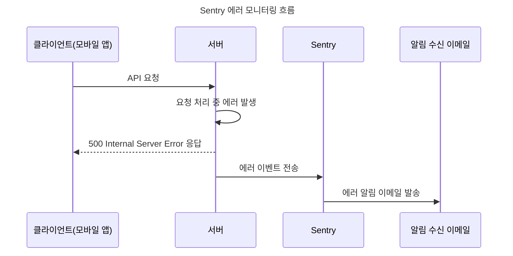

# Sentry 에러 모니터링

```mermaid
sequenceDiagram
    title Sentry 에러 모니터링 흐름
    participant cli as 클라이언트(모바일 앱)
    participant sv as 서버
    participant sen as Sentry
    participant mail as 알림 수신 이메일
    
    cli ->> sv: API 요청
    sv ->> sv: 요청 처리 중 에러 발생
    sv -->> cli: 500 Internal Server Error 응답
    sv ->> sen: 에러 이벤트 전송
    sen ->> mail: 에러 알림 이메일 발송
```