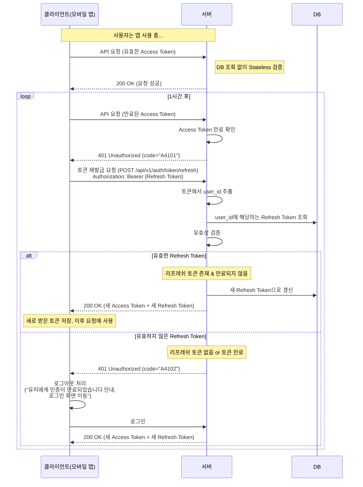

<!-- TOC -->
  * [OIDC 로그인](#oidc-로그인)
  * [액세스 토큰 갱신](#액세스-토큰-갱신)
<!-- TOC -->

## OIDC 로그인

## 액세스 토큰 갱신

- 공격자 탈취할 때 별도의 에러 코드를 내려주도록 개선 필요.
  - case1. 리프레쉬 토큰 만료: 정상 케이스
    - 401 Unauthorized, code="A4102" 리턴
  - case2. 토큰 없음/불일치: 탈취 케이스. 리프레쉬 토큰이 다른 사용자에 의해 먼저 사용됨.
    - 401 Unauthorized, code="A4103" 리턴